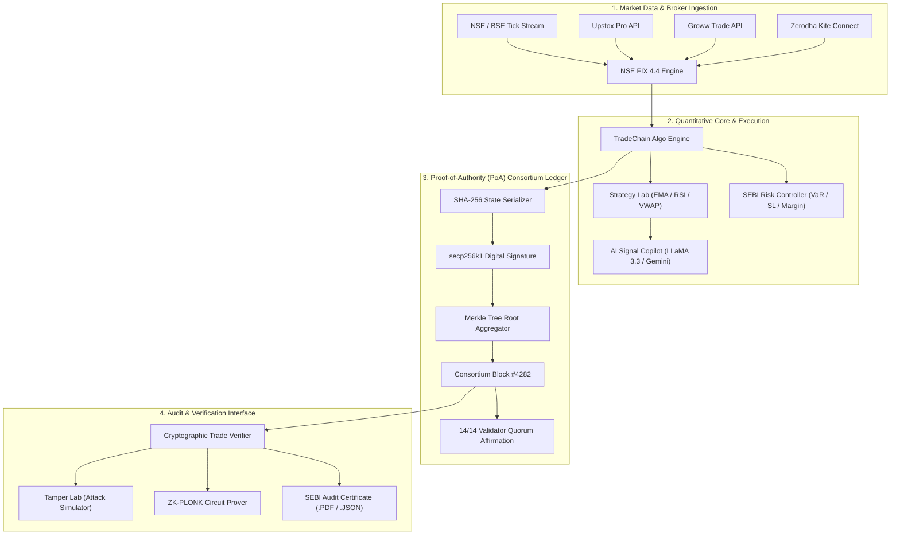

# TradeChain — Institutional Algorithmic Trading & Cryptographic Audit Platform ⚡🛡️

<div align="center">

[](https://tradechain-platform.vercel.app/)
[](https://react.dev/)
[](https://www.typescriptlang.org/)
[](https://vitejs.dev/)
[](https://tailwindcss.com/)
[](LICENSE)

<p align="center">
  <strong>An institutional-grade algorithmic trading workstation, backtesting sandbox, and Proof-of-Authority (PoA) blockchain verification engine localized for the Indian Equity / F&O markets (NSE, BSE) and digital asset derivatives.</strong>
</p>

[🌐 Live Web Application](https://tradechain-platform.vercel.app/) • [📦 GitHub Repository](https://github.com/itzdevilsunny/tradechain-platform) • [📖 Documentation](#-system-architecture) • [⚡ Quick Start](#-quick-start--local-setup)

</div>

---

## 🏛️ Executive Summary

**TradeChain** bridges high-frequency algorithmic trade execution across Indian broker APIs (**Upstox Pro API**, **Groww Trade Gateway**, **Zerodha Kite Connect**, and institutional **NSE FIX 4.4 Gateways**) with **immutable cryptographic state proof verification**.

Every order placement, strategy mutation, stop-loss trigger, and position liquidation is cryptographically digested into a **SHA-256 state hash**, signed via **ECDSA secp256k1**, bound into a **Merkle Tree**, and anchored to an on-chain consortium block. This guarantees zero-knowledge non-repudiation, tamper-evident audit trails, and strict compliance with SEBI algorithmic trading mandates.

---

## 🌟 Core Pillars & Key Features

### 1. 📊 Institutional Trading Overview Desk
* **Live Indian Indices Pulse**: Real-time streaming pulse for `NIFTY 50`, `BANK NIFTY`, `FIN NIFTY`, `SENSEX`, and `INDIA VIX` with tick-level percentage badges.
* **Instant Order Execution Modal**: Direct market/limit order entry routing to Upstox, Groww, Zerodha, or NSE FIX with real-time value and margin computation.
* **Emergency Stop All**: 1-click panic liquidation modal that closes all open market exposure and commits immediate terminal records to the ledger.
* **Sector Performance Heatmap**: Real-time 1-minute heatmap tracking Nifty IT, Banking, Auto, Pharma, Metals, and FMCG alongside the Advances/Declines breadth ratio.
* **5 Executive KPI Cards**: Dynamic tracking of Portfolio Value, Today's P&L, Active Positions (Long/Short), Win Rate (71.4%), and 100% Chain Integrity.

### 2. 🤖 Autonomous Trading Bot Control
* **Active Strategies Grid**: Real-time strategy cards with live toggle switches (`RUNNING` / `PAUSED`), fill rates, and signals generated today.
* **Manual Order Routing**: Order placement form supporting multiple order types (`MARKET`, `LIMIT`, `SL-M`) and exchange gateway selection.
* **Performance Analytics**: Recharts cumulative P&L equity curves and strategy comparative bar visualizers.
* **Level 2 Order Book Depth**: Live simulated bid/ask depth ladder with dynamic spreads and animated micro-flashes.
* **Execution Terminal**: Real-time streaming terminal with severity filtering (`INFO`, `SIGNAL`, `EXECUTION`, `WARN`, `BLOCK`) and 1-click log downloader.

### 3. 🧪 Strategy Lab & Parameter Optimizer
* **Strategy Registry**: Real-time search and status filtering (`ALL`, `ACTIVE`, `PAUSED`). Direct actions to backtest, configure parameters, clone strategy, export JSON manifest, and decommission.
* **Comparative Analytics Matrix**: Benchmark returns, win rates, and drawdowns across algorithms with risk-adjusted metrics (Profit Factor, Sharpe Ratio, Expectancy).
* **Interactive Parameter Optimizer**: Monte Carlo 500-trade sweep sandbox with live sliders for Fast/Slow EMA, RSI thresholds, SL/TP %, and equity curve visualizer.
* **Cryptographic Invariant Binding**: Modifying any quantitative parameter dynamically recomputes and binds a fresh SHA-256 state hash.
* **Algorithm Code Viewer**: View production-ready Python 3.11 quantitative trading models and download JSON manifests.

### 4. 🛡️ Cryptographic Audit & Verification Engine
* **Single Trade Verifier**: 6-stage verification lifecycle confirming canonical JSON intake, SHA-256 digest, secp256k1 digital signatures, Merkle path inclusion, PoA block consensus, and immutability.
* **Tamper Lab (Attack Simulator)**: Interactive adversarial testing sandbox where users can mutate trade price, volume, or timestamp to observe real-time SHA-256 collision and Merkle proof rejection.
* **Batch Verification Queue**: Parallel verification engine validating multi-trade batches with progress tracking.
* **14-Node Consortium Quorum Dashboard**: Real-time status, latency, public keys, and last-signed blocks for NSE Alpha, BSE Beta, SEBI Audit Node, Upstox Validator, Groww Attester, and Zerodha Nodes.
* **Zero-Knowledge PLONK Prover**: Groth16 circuit over BN254 curve proving trade correctness without disclosing confidential trade sizes or execution prices.
* **SEBI Audit Certificate Modal**: Generates official, downloadable, and printable cryptographic compliance certificates with Merkle inclusion paths and consortium signatures.

### 5. 📜 Enterprise Cryptographic Audit Trail
* **Append-Only Event Ledger**: Continuous record of all order actions, block commitments, strategy updates, and risk limit changes.
* **Live Event Simulator**: Inject real-time governance, risk, and consensus events with immediate SHA-256 state anchoring.
* **Sequential Chain Integrity Checking**: Traverses log pointers to verify zero breaks in hash sequence.
* **Multi-Format Export**: 1-click export to CSV and JSON for external auditor compliance.

### 6. 📉 Comprehensive Backtesting Engine
* Historical candle playback across Indian equities (Reliance, HDFC Bank, Infosys, NIFTY 50 Futures).
* Dynamic performance visualizers: Cumulative Equity Trajectory, Drawdown Depth Spectrums, Monthly Return Heatmaps, and Trade Distribution tables.

### 7. ⚖️ Risk Management Center
* Real-time portfolio Value at Risk (VaR 95% & 99%), Maximum Drawdown circuit breakers, Leverage caps, and automated Pre-Trade margin checks.

---

## 📐 System Architecture



---

## 💻 Tech Stack & Architecture

| Layer | Technology | Purpose |
| :--- | :--- | :--- |
| **Frontend Framework** | **React 19.0.0** + **TypeScript 5.7** | Core component state, strict typing, responsive rendering |
| **Build & Tooling** | **Vite 6.1** | Sub-second HMR, optimized production bundling |
| **Styling & Design** | **Tailwind CSS 3.4** + Vanilla CSS | Institutional dark/light themes, tactile 3D linear buttons |
| **Data Visualization** | **Recharts 2.15** + HTML5 Canvas | Real-time candlestick charts, equity curves, drawdown areas |
| **Icons & Assets** | **Lucide React** | Consistent institutional icon library |
| **AI Copilot** | **Groq LLaMA-3.3-70b** + **Gemini 1.5 Flash** | Quantitative trade reasoning and market sentiment |
| **Cryptography** | **SHA-256**, **ECDSA secp256k1**, **Merkle Trees** | Immutability, non-repudiation, tamper detection |
| **Deployment** | **Vercel** | Edge network hosting, continuous deployment CI/CD |

---

## 🚀 Quick Start & Local Setup

### Prerequisites
* **Node.js**: v18.0.0 or higher
* **npm**: v9.0.0 or higher

### 1. Clone the Repository
```bash
git clone https://github.com/itzdevilsunny/tradechain-platform.git
cd tradechain-platform
```

### 2. Install Dependencies
```bash
npm install
```

### 3. Environment Variables Configuration
Copy the template environment file:
```bash
cp .env.example .env
```
Ensure your `.env` contains your preferred configuration:
```env
VITE_SUPABASE_URL=https://your-project.supabase.co
VITE_SUPABASE_ANON_KEY=your-anon-key
VITE_GROQ_API_KEY=your-groq-api-key
VITE_GEMINI_API_KEY=your-gemini-api-key
```

### 4. Start Local Development Server
```bash
npm run dev
```
Navigate to `http://127.0.0.1:3000` in your web browser.

### 5. Production Build & Validation
```bash
npm run build
```
Executes TypeScript type-checking (`tsc`) followed by Vite production bundling into `/dist`.

---

## 🔒 Cryptographic Verification Walkthrough

TradeChain utilizes a 6-stage mathematical attestation model:

1. **Intake & Serialization**: The order payload is canonically formatted according to RFC 8785 (JSON Canonicalization Scheme).
2. **SHA-256 Digest**: A deterministic hash is computed:
   $$\text{Digest} = \text{SHA256}(\text{TradePayload})$$
3. **ECDSA Signature**: The executing validator node signs the digest with its private secp256k1 key.
4. **Merkle Path Proof**: The transaction hash is inserted as a leaf in the block's binary Merkle tree:
   $$\text{Node}_{k} = \text{SHA256}(\text{Child}_{\text{left}} \parallel \text{Child}_{\text{right}})$$
5. **PoA Consensus**: The block is proposed to the 14 consortium nodes; 11/14 threshold confirms validity.
6. **Immutability Guarantee**: Any alteration to price or volume mutates the root hash, triggering instantaneous rejection in the **Tamper Lab**.

---

## 🌐 Live Deployment

The platform is continuously deployed on Vercel:
**[https://tradechain-platform.vercel.app/](https://tradechain-platform.vercel.app/)**

---

## 📄 License

Distributed under the **MIT License**. See `LICENSE` for more information.

---

<div align="center">
  <sub>Engineered with precision for quantitative traders and compliance officers. Built by <strong>Sunny Prasad</strong>.</sub>
</div>
